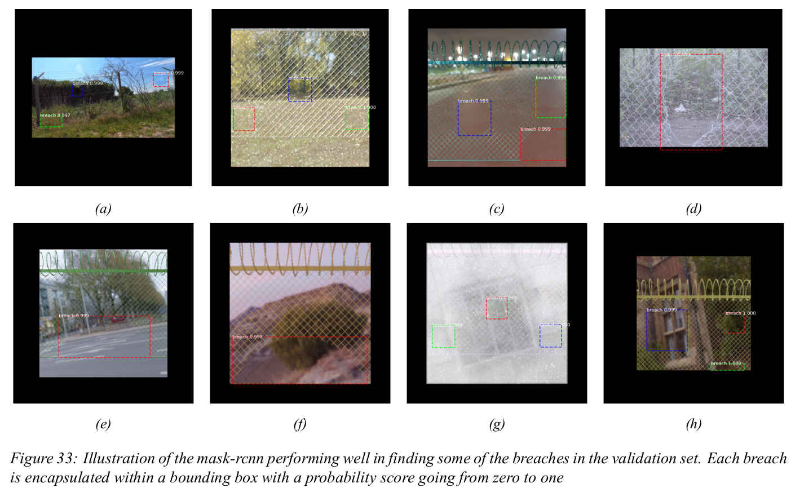
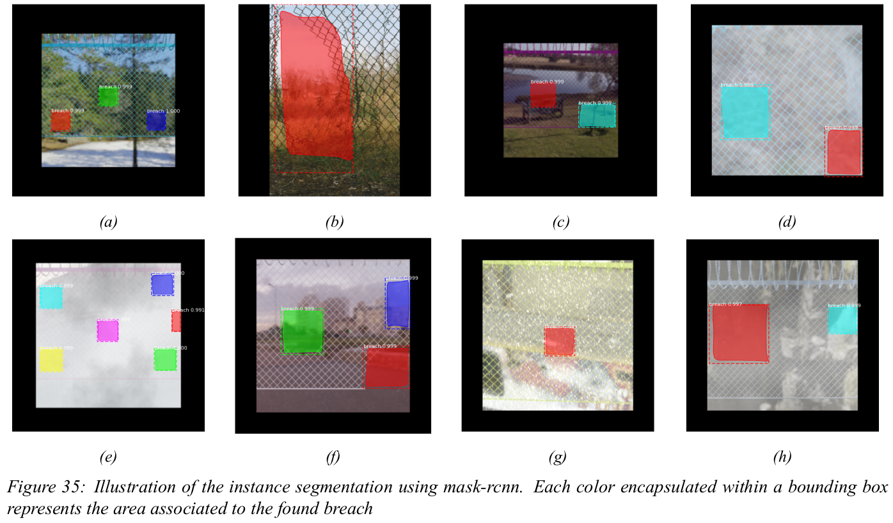

# Fence inspection for breach detection using drones autonomously
## _Image classification and boundary box regression using mask-RCNN_

In this project an automated drone solution for fence inspection was developed. This system will contribute to maintenance
and heightened security of different high-end security places e.g. an airport. A test of the different sensors has been
completed, to find the sensor most suitable for the task. Furthermore, an automated route planning algorithm has been
developed with easy tuning for the end-user. This will help the end-user setup the drone for their companies specific needs.
A deep analysis of different vision algorithms has been conducted to achieve the best possible outcome with data from the
chosen sensor.
Moreover, Convolution Neural Network (CNN) has been developed and trained to locate breaches in the grid structure
of the fences. This has been done using mask-rcnn. The network was trained with an augmented dataset of almost 7000
images which consisted of artificial snow, rain, fog and other kinds of noise in the images to replicate real-life scenarios.

Some of the results can be seen in Figure 33 and 34. Here all the breaches have been located using image classification and boundary boxes regression.  

  

  

This yielded good results with a mean average precision (mAP) of 0.874 in the augmented test set of 1395 images as well
a correct detection of all custom made breaches in the final acceptance test. However, furture work must be done in order to implement the solution on a UAV for autonoumous applications. 

The overall theory about this implemenation and how this has been implemented can be seen in the report 
[Experts in Teams Innovation - Fence inspection for Lorenz Technology](https://github.com/Kenil16/fence_inspection_using_drones/blob/main/report/Head/Main.pdf).

